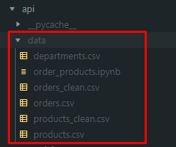

## Getting Started

To run this project you need to have Docker installed on your system.

First run this command on the root directory where the **docker-compose.yml** file is located:
    ```docker compose build```

Then run: ```docker compose up```

After this you can access the **API (Python Back End REST API)** in `localhost:5000` while the **dashboard** will run on `localhost:3000`.


## Prerequisites if you don't use Docker

For the API part you need to run these commands to install the used libraries:
1. `pip install flask`
2. `pip install pandas`
3. `pip install flask_cors`

For the Dashboard you need to run `npm i` to install all the libraries listed on the package.json file.

Keep in mind that the CSV files are not pushed into this repository because they are big files. You have to create a folder named **`data`** and then include those CSV file in this path: ./api/data



## API Endpoints

### GET     /products?page=`<int>`  

Where the _page_ can be from 0 to how many items are. A page will load just 10 items each.

For this get request you get a list of products saved in the CSV files, for example:

    {
        "aisle_id": 123,
        "department_id": 4,
        "prices": 7.5,
        "product_id": 31,
        "product_name": "White Pearl Onions"
    }
    ...


### GET     /products/`<int>`  

For this get request you get a specific product's data:

    {
        "aisle_id": 123,
        "department_id": 4,
        "prices": 7.5,
        "product_id": 31,
        "product_name": "White Pearl Onions"
    }


### GET     /orders?page=`<int>`    

Where the _page_ can be from 0 to how many items are. A page will load just 10 items each.

For this get request you get a list of orders saved in the CSV files, for example:

    {
        "days_since_prior_order": 14.0,
        "order_hour_of_day": 8,
        "order_id": 1187899,
        "order_number": 11,
        "orders_day_of_week": 4,
        "user_id": 1
    }


### GET     /orders/`<int>`  

For this get request you get a specific order's data:

    {
        "days_since_prior_order": 14.0,
        "order_hour_of_day": 8,
        "order_id": 1187899,
        "order_number": 11,
        "orders_day_of_week": 4,
        "user_id": 1
    }


### GET     /departments

For this get request you get the list of all departments saved in the CSV files:

    {
        "departments": [
            {
                "1": "frozen",
                "10": "bulk",
                "11": "personal care",
                "12": "meat seafood",
                "13": "pantry",
                "14": "breakfast",
                "15": "canned goods",
                "16": "dairy eggs",
                "17": "household",
                "18": "babies",
                "19": "snacks",
                "2": "other",
                "20": "deli",
                "21": "missing",
                "3": "bakery",
                "4": "produce",
                "5": "alcohol",
                "6": "international",
                "7": "beverages",
                "8": "pets",
                "9": "dry goods pasta"
            }
        ]
    }


### GET     /dataFunctions/number_of_products_by_department    

For this get request you get the number of products grouped by department:

    {
        "number_of_products_by_department": {
            "alcohol": 1056,
            "babies": 1081,
            "bakery": 1516,
            "beverages": 4365,
            "breakfast": 1116,
            "bulk": 38,
            "canned goods": 2092,
            "dairy eggs": 3449,
            "deli": 1322,
            "dry goods pasta": 1858,
            "frozen": 4007,
            "household": 3085,
            "international": 1139,
            "meat seafood": 907,
            "missing": 1258,
            "other": 548,
            "pantry": 5371,
            "personal care": 6565,
            "pets": 972,
            "produce": 1684,
            "snacks": 6264
        }
    }


### GET     /dataFunctions/number_of_orders_per_user    

For this get request you get the number of orders per user, sorted by the user that has made the most orders:

    {
        "152340": 100,
        "185641": 100,
        "185524": 100,
        "81678": 100,
        "70922": 100,
        "136870": 100,
        "81704": 100,
        ...
    }


### GET     /dataFunctions/number_of_orders_per_hour    

For this get request you get the number of products per hour:

    {
        "10": 288418,
        "11": 284728,
        "15": 283639,
        "14": 283042,
        "13": 277999,
        "12": 272841,
        "16": 272553,
        "9": 257812,
        "17": 228795,
        "18": 182912,
        "8": 178201,
        "19": 140569,
        "20": 104292,
        "7": 91868,
        "21": 78109,
        "22": 61468,
        "23": 40043,
        "6": 30529,
        "0": 22758,
        "1": 12398,
        "5": 9569,
        "2": 7539,
        "4": 5527,
        "3": 5474
    }


### GET     /dataFunctions/orders_daily    

For this get request you get the number of orders made in the last month:

    {
        "30.0": 369323,
        "29.0": 19191,
        "28.0": 26777,
        "27.0": 22013,
        "26.0": 19016,
        "25.0": 19234,
        "24.0": 20712,
        "23.0": 23885,
        "22.0": 32012,
        "21.0": 45470,
        "20.0": 38527,
        "19.0": 34384,
        "18.0": 35881,
        "17.0": 39245,
        "16.0": 46941,
        "15.0": 66579,
        "14.0": 100230,
        "13.0": 83214,
        "12.0": 76146,
        "11.114836226863012": 206209,
        "11.0": 80970,
        "10.0": 95186,
        "9.0": 118188,
        "8.0": 181717,
        "7.0": 320608,
        "6.0": 240013,
        "5.0": 214503,
        "4.0": 221696,
        "3.0": 217005,
        "2.0": 193206,
        "1.0": 145247,
        "0.0": 67755
    }